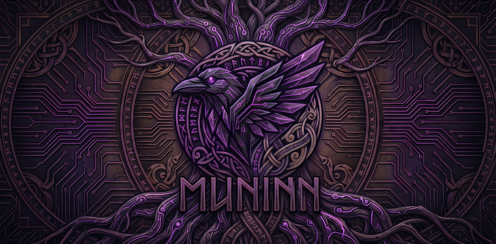

# Muninn: Persistent Memory for AI Agents

```text
███╗   ███╗██╗   ██╗███╗   ██╗██╗███╗   ██╗███╗   ██╗
████╗ ████║██║   ██║████╗  ██║██║████╗  ██║████╗  ██║
██╔████╔██║██║   ██║██╔██╗ ██║██║██╔██╗ ██║██╔██╗ ██║
██║╚██╔╝██║██║   ██║██║╚██╗██║██║██║╚██╗██║██║╚██╗██║
██║ ╚═╝ ██║╚██████╔╝██║ ╚████║██║██║ ╚████║██║ ╚████║
╚═╝     ╚═╝ ╚═════╝ ╚═╝  ╚═══╝╚═╝╚═╝  ╚═══╝╚═╝  ╚═══╝
     ᛗ The Persistent Memory MCP ᚱ
```

**Local-first, assistant-agnostic persistent memory for AI agents via the [Model Context Protocol (MCP)](https://modelcontextprotocol.io/).**

Muninn decouples memory from any single AI assistant — Claude, Gemini, Codex, and others — and provides persistent, searchable, cross-session memory that lives entirely on your machine.

> **v3.0 — Native Engine**: Purpose-built memory framework with neuroscience-inspired consolidation, multi-factor importance scoring, 4-signal hybrid retrieval, and LLM-free extraction. Zero cloud calls. Zero data leaves your machine.

---

## Why Muninn?

Every AI assistant forgets between sessions. Muninn solves this with a shared memory layer that:

- **Remembers across assistants** — Switch between Claude Code, Gemini CLI, and Codex CLI without losing context
- **Runs 100% locally** — Your data never leaves your machine. No API keys, no cloud services, no telemetry
- **Requires no LLM for extraction** — Rule-based entity/relation extraction at zero latency (with optional LLM tiers for deeper analysis)
- **Manages memory intelligently** — Memories decay, merge, promote, and consolidate automatically like biological memory

### How Muninn Compares

| Capability | Muninn | Others | Standard Implementations |
|---|:---:|:---:|:---:|
| Local-first (zero cloud) | **Yes** | Partial | Varies |
| LLM-free extraction | **Yes** | No | No |
| Multi-signal hybrid search | **4 signals + reranker** | Vector only | Vector/keyword |
| Knowledge graph | **Kuzu embedded** | Partial | None |
| Memory lifecycle | **4-tier hierarchy** | Flat | Flat |
| Importance scoring | **5-factor formula** | None | None |
| Background consolidation | **Async daemon** | None | None |
| Cross-encoder reranking | **Jina reranker** | None | None |
| Assistant agnostic | **Any MCP client** | Varies | Varies |

---

## Features

### 4-Signal Hybrid Retrieval

Vector similarity (Qdrant HNSW) + BM25 keyword search + graph traversal (Kuzu) + temporal recency, fused via Reciprocal Rank Fusion and refined by a Jina cross-encoder reranker.

### Neuroscience-Inspired Memory Hierarchy

Modeled after Complementary Learning Systems (CLS) theory:

```
Working Memory     (ephemeral, 24h TTL)
       ↓  importance threshold
Episodic Memory    (specific events, decisions)
       ↓  pattern extraction
Semantic Memory    (distilled facts, knowledge)
       ↓  repeated access
Procedural Memory  (workflows, habits, patterns)
```

### 3-Tier Extraction Pipeline

1. **Rules** (Tier 1) — Regex-based extraction for tech terms, file paths, URLs, preferences, dependencies. Zero latency, zero cost.
2. **xLAM** (Tier 2) — Salesforce xLAM function-calling model for structured chain-of-extraction. Local via Ollama.
3. **Ollama fallback** (Tier 3) — General-purpose local LLM for complex extraction scenarios.

### Multi-Factor Importance Scoring

Each memory receives a composite importance score from 5 weighted factors:

- **Recency decay** (25%) — Exponential time-based decay
- **Access frequency** (15%) — How often the memory is retrieved
- **Graph centrality** (20%) — Connectedness in the knowledge graph
- **Novelty** (25%) — Information gain relative to existing memories
- **Provenance** (15%) — Source reliability (user-explicit > assistant-confirmed > auto-extracted)

### Background Consolidation

An async daemon runs 5 lifecycle phases on a configurable schedule:

- **Decay** — Apply time-based importance reduction
- **Merge** — Deduplicate near-identical memories (cosine threshold 0.92)
- **Promote** — Advance memories through the type hierarchy based on access patterns
- **Replay** — Strengthen important memories via simulated retrieval
- **Statistics** — Track system health and memory distribution

---

## Architecture

```
muninn_mcp/
├── muninn/                    # Core framework package
│   ├── core/                  # Memory engine, types, config
│   │   ├── memory.py          # MuninnMemory class (add, search, update, delete)
│   │   ├── types.py           # Pydantic models & enums
│   │   └── config.py          # Centralized configuration (env + YAML)
│   ├── store/                 # Storage backends
│   │   ├── vector_store.py    # Qdrant HNSW vectors (768-dim, cosine)
│   │   ├── graph_store.py     # Kuzu embedded knowledge graph
│   │   └── sqlite_metadata.py # SQLite WAL-mode metadata
│   ├── extraction/            # Entity & relation extraction
│   │   ├── rules.py           # Rule-based zero-latency extraction
│   │   └── pipeline.py        # Tiered extraction orchestrator
│   ├── retrieval/             # Multi-signal search
│   │   ├── hybrid.py          # RRF fusion retriever
│   │   ├── bm25.py            # In-memory BM25 index (K1=1.2, B=0.75)
│   │   └── reranker.py        # Jina cross-encoder reranker
│   ├── scoring/               # Importance scoring
│   │   └── importance.py      # Multi-factor importance formula
│   ├── sdk/                   # Python SDK (sync + async REST clients)
│   │   ├── client.py          # MuninnClient / AsyncMuninnClient / aliases
│   │   └── errors.py          # SDK exception hierarchy
│   ├── ingestion/             # Multi-source ingestion (v3.3.0)
│   │   ├── pipeline.py        # Fail-open source ingestion orchestrator
│   │   ├── parser.py          # Safe parser adapters (txt/md/json/jsonl/csv/html/sqlite/pdf/docx)
│   │   └── discovery.py       # Legacy assistant/MCP source discovery catalog
│   └── consolidation/         # Background memory lifecycle
│       ├── daemon.py          # Async consolidation loop
│       ├── merge.py           # Near-duplicate merging
│       └── promote.py         # Memory type promotion
├── server.py                  # FastAPI backend (REST API)
├── mcp_wrapper.py             # MCP stdio bridge (auto-starts server)
├── tray_app.py                # Windows system tray application
├── dashboard.html             # Web dashboard for memory visualization
├── ingest_history.py          # Multi-assistant history ingestion
└── pyproject.toml             # Package metadata & dependencies
```

---

## Installation

### Prerequisites

- **Python 3.10+**
- **[Ollama](https://ollama.com)** with `nomic-embed-text` model pulled
- (Optional) xLAM model for advanced entity extraction

### Setup

```bash
git clone https://github.com/AntigravityLabs/muninn-mcp.git
cd muninn-mcp
pip install -r requirements.txt
```

### Pull Embedding Model

```bash
ollama pull nomic-embed-text
```

---

## Configuration

### Claude Code

```bash
claude mcp add muninn -s user -- python /path/to/muninn-mcp/mcp_wrapper.py
```

### Claude Desktop (`claude_desktop_config.json`)

```json
{
  "mcpServers": {
    "muninn": {
      "command": "python",
      "args": ["/path/to/muninn-mcp/mcp_wrapper.py"]
    }
  }
}
```

### Cursor (`~/.cursor/mcp.json`)

```json
{
  "mcpServers": {
    "muninn": {
      "command": "python",
      "args": ["/path/to/muninn-mcp/mcp_wrapper.py"]
    }
  }
}
```

### Gemini CLI (`.gemini/settings.json`)

```json
{
  "mcpServers": {
    "muninn": {
      "command": "python",
      "args": ["/path/to/muninn-mcp/mcp_wrapper.py"]
    }
  }
}
```

### Codex CLI (`.codex/config.toml`)

```toml
[mcp_servers.muninn]
command = "python"
args = ["/path/to/muninn-mcp/mcp_wrapper.py"]
```

> **Note:** Replace `/path/to/muninn-mcp/` with the actual path to your installation. On Windows, use the full path to your Python executable (e.g., `C:\Python313\python.exe`).

### Environment Variables

| Variable | Default | Description |
|---|---|---|
| `MUNINN_DATA_DIR` | `~/.muninn/data` | Base data directory |
| `MUNINN_HOST` | `127.0.0.1` | Server bind address |
| `MUNINN_PORT` | `42069` | Server port |
| `MUNINN_EMBEDDING_MODEL` | `nomic-embed-text` | Ollama embedding model |
| `MUNINN_EMBEDDING_DIMS` | `768` | Embedding dimensions |
| `MUNINN_OLLAMA_URL` | `http://localhost:11434` | Ollama server URL |
| `MUNINN_RERANKER_ENABLED` | `true` | Enable cross-encoder reranking |
| `MUNINN_CONSOLIDATION_ENABLED` | `true` | Enable background consolidation |
| `MUNINN_SERVER_URL` | `http://localhost:42069` | Server URL for MCP wrapper |

---

## MCP Tools

| Tool | Description |
|------|-------------|
| `add_memory` | Store a new memory with optional metadata tags |
| `search_memory` | Hybrid search across all 4 signals with reranking |
| `get_all_memories` | Retrieve all stored memories (paginated) |
| `update_memory` | Update an existing memory by ID |
| `delete_memory` | Delete a specific memory by ID |
| `delete_all_memories` | Delete all memories (requires confirmation) |
| `ingest_sources` | Ingest local files/directories with provenance-rich fail-open parsing |
| `discover_legacy_sources` | Discover reingestable legacy assistant and MCP memory artifacts |
| `ingest_legacy_sources` | Ingest selected legacy sources with contextual metadata |

---

## REST API

When the server is running (`http://localhost:42069`):

| Method | Endpoint | Description |
|--------|----------|-------------|
| `GET` | `/health` | Server and subsystem health check |
| `POST` | `/add` | Add a new memory |
| `POST` | `/search` | Hybrid search with query |
| `POST` | `/ingest` | Multi-source ingestion (feature-gated) |
| `POST` | `/ingest/legacy/discover` | Discover local legacy assistant/MCP memory artifacts |
| `POST` | `/ingest/legacy/import` | Import selected legacy artifacts into Muninn |
| `POST` | `/goal/set` | Set project north-star goal |
| `GET` | `/goal/get` | Get active project goal |
| `POST` | `/handoff/export` | Export deterministic handoff bundle |
| `POST` | `/handoff/import` | Import handoff bundle idempotently |
| `POST` | `/feedback/retrieval` | Record retrieval feedback for adaptive calibration |
| `GET` | `/get_all` | Retrieve all memories |
| `PUT` | `/update` | Update memory by ID |
| `DELETE` | `/delete/{memory_id}` | Delete memory by ID |
| `GET` | `/graph` | Knowledge graph statistics |
| `POST` | `/handover` | Generate cross-assistant handover context |
| `POST` | `/consolidation/run` | Manually trigger consolidation |
| `GET` | `/consolidation/status` | Consolidation status |

---

## Python SDK

Muninn includes first-party sync + async clients for REST integration:

```python
from muninn import Memory

client = Memory(base_url="http://localhost:42069")
client.add(content="User prefers deterministic CI gates", metadata={"project": "muninn"})
results = client.search("What does the user prefer?", explain=True)
print(results[0]["memory"]["content"])
```

```python
import asyncio
from muninn import AsyncMemory

async def main():
    async with AsyncMemory() as client:
        await client.set_project_goal(
            project="muninn",
            goal_statement="Ship Phase 3 safely with tests",
            constraints=["backward-compatible", "local-first"],
        )
        goal = await client.get_project_goal(project="muninn")
        print(goal)

asyncio.run(main())
```

See `docs/PYTHON_SDK.md` for full method coverage and error handling.

---

## Dashboard

Visit `http://localhost:42069` when the server is running to access the browser control center. It includes:

- Legacy source discovery and checkbox-based reingestion of assistant/MCP memory artifacts.
- Project-folder ingestion with chronological ordering (`none`, `oldest_first`, `newest_first`).
- Search and system operations in one UI.

---

## History Ingestion

Import existing conversation history from your AI assistants and MCP memory sources:

```bash
# Discover only (no writes)
python ingest_history.py --discover-only --agent all

# Import all parser-supported discovered sources for selected providers
python ingest_history.py --provider codex_cli --provider serena_memory --all-discovered

# Import with chronological ordering
python ingest_history.py --agent claude --all-discovered --chronological-order oldest_first
```

---

## Testing

```bash
# Run all tests
python -m pytest tests/ -v

# Run specific test module
python -m pytest tests/test_bm25.py -v

# Verify canonical eval artifact integrity + reproducibility
python -m eval.artifacts verify --preset vibecoder_memoryagentbench_v1
python -m eval.artifacts verify --all
```

---

## Data Storage

All data is stored locally in `~/.muninn/data/` by default:

```
~/.muninn/data/
├── vectors/        # Qdrant vector index (HNSW, on-disk)
├── graph/          # Kuzu knowledge graph database
├── metadata.db     # SQLite metadata store (WAL mode)
└── bm25_index/     # BM25 inverted index cache
```

---

## Roadmap

See [SOTA_PLUS_PLAN.md](SOTA_PLUS_PLAN.md) for the complete implementation roadmap. Planned features include:

- **Explainable recall traces** — Transparency into why each memory was retrieved
- **Conflict detection** — NLI-based contradiction detection between memories
- **Semantic deduplication** — Embedding-based near-duplicate prevention
- **Adaptive retrieval weights** — Entropy-based dynamic signal weighting
- **Memory chains** — Temporal/causal linking of related memories
- **Multi-source ingestion** — PDF, Markdown, and structured document import (**implemented**: feature-gated fail-open pipeline)
- **Python SDK** — Programmatic API for non-MCP integration (**implemented**: sync + async clients)
- **Cross-platform support** — Linux and macOS path resolution

---

## Documentation

- [Architecture Deep Dive](docs/ARCHITECTURE.md) — Full design document with research references
- [Citations & Credits](CITATIONS.md) — Academic sources and open-source attribution
- [SOTA+ Roadmap](SOTA_PLUS_PLAN.md) — Next-generation feature implementation plan
- [OTel GenAI Runbook](docs/OTEL_GENAI_OBSERVABILITY.md) — Trace export setup and privacy controls
- [Python SDK Guide](docs/PYTHON_SDK.md) — Sync/async client usage and mem0-style aliases
- [Ingestion Guide](docs/INGESTION_PIPELINE.md) — Feature-gated multi-source ingestion setup and safety profile

---

## License

[Apache License 2.0](LICENSE)

W.Johns All Rights reserved
